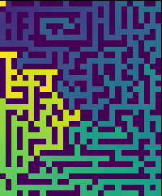
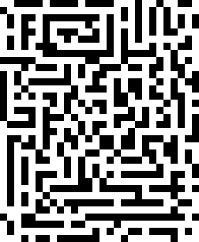

# mazegradient
 

 Visualizes distance from the start to any point in a binary maze using a gradient.
The start is bright yellow, and then the gradient moves from purple-blue-green-yellow as the distance from the start point increases. The walls are dark purple.

# Set up
 You can run maze.py like any other python file, such as through the command line.
 Before that, the following two files need to be set up.

 ## maze.png: 
 Create or move a black (walls) & white (path) pixel maze to the same location as maze.py and name it maze.png.
 If parts of the maze are unreachable, they won't show up on the output.
 

 ## config.txt:
 Copy defaultconfig.txt and rename it to config.txt. Then set the following configuration up.
 ### Required:
 - mode: 'binary' will display the maze with no gradient, and 'gradient' will display the gradient of distance from start point
 - start_y and start_x: X and Y values for the start point. Make sure this is set to a pixel with path on it! To find the coordinate of a point, run the program in binary mode and zoom in.
 ### Can be left alone:
 - gradient_range: Integer used for determining gradient colour. It may need to be scaled according to the size of the image (big image = big value). Increase the value if your gradient is too yellow, and decrease the value if your gradient is too blue.
 
 
